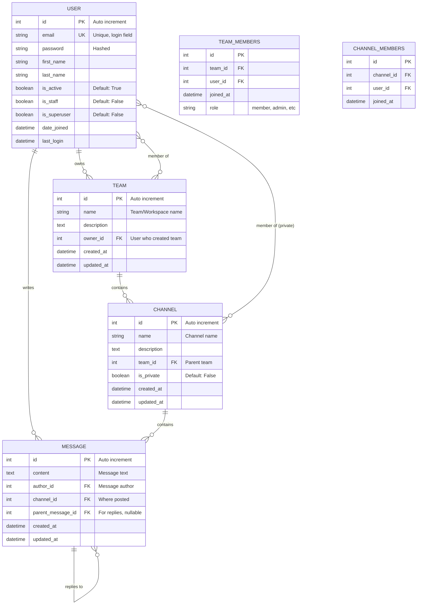

```mermaid
erDiagram
    %% Teams Clone - ER Diagram
    %% Can be rendered in GitHub, GitLab, or https://mermaid.live/
    
    USER ||--o{ TEAM : "owns"
    USER }o--o{ TEAM : "member of"
    TEAM ||--o{ CHANNEL : "contains"
    USER }o--o{ CHANNEL : "member of (private)"
    USER ||--o{ MESSAGE : "writes"
    CHANNEL ||--o{ MESSAGE : "contains"
    MESSAGE ||--o{ MESSAGE : "replies to"
    
    USER {
        int id PK "Auto increment"
        string email UK "Unique, login field"
        string password "Hashed"
        string first_name
        string last_name
        boolean is_active "Default: True"
        boolean is_staff "Default: False"
        boolean is_superuser "Default: False"
        datetime date_joined
        datetime last_login
    }
    
    TEAM {
        int id PK "Auto increment"
        string name "Team/Workspace name"
        text description
        int owner_id FK "User who created team"
        datetime created_at
        datetime updated_at
    }
    
    TEAM_MEMBERS {
        int id PK
        int team_id FK
        int user_id FK
        datetime joined_at
        string role "member, admin, etc"
    }
    
    CHANNEL {
        int id PK "Auto increment"
        string name "Channel name"
        text description
        int team_id FK "Parent team"
        boolean is_private "Default: False"
        datetime created_at
        datetime updated_at
    }
    
    CHANNEL_MEMBERS {
        int id PK
        int channel_id FK
        int user_id FK
        datetime joined_at
    }
    
    MESSAGE {
        int id PK "Auto increment"
        text content "Message text"
        int author_id FK "Message author"
        int channel_id FK "Where posted"
        int parent_message_id FK "For replies, nullable"
        datetime created_at
        datetime updated_at
    }
```
